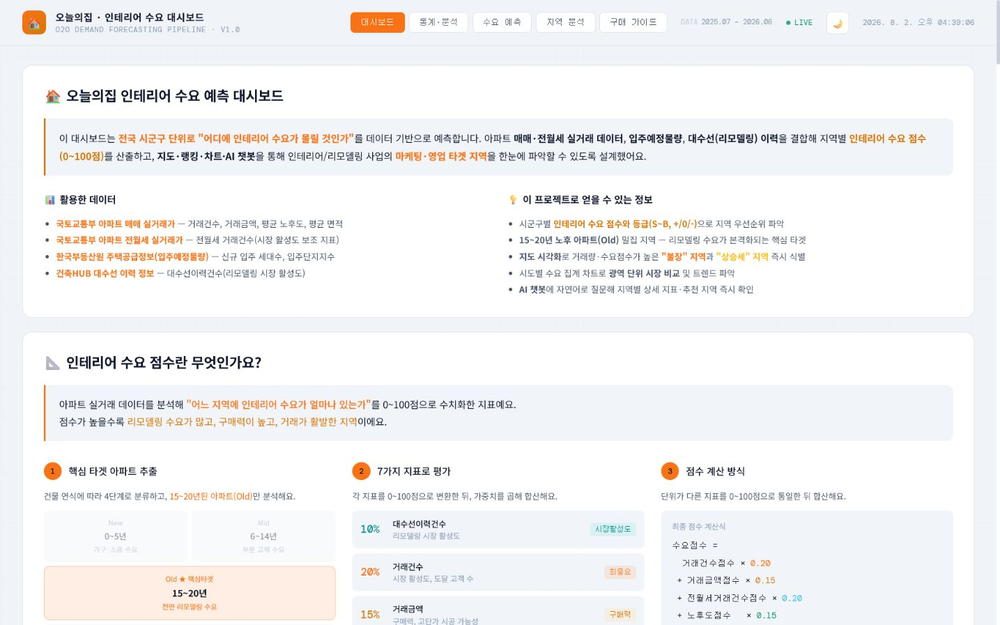
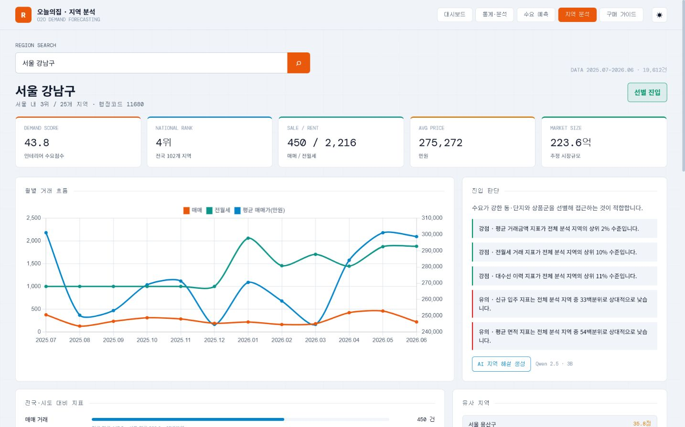
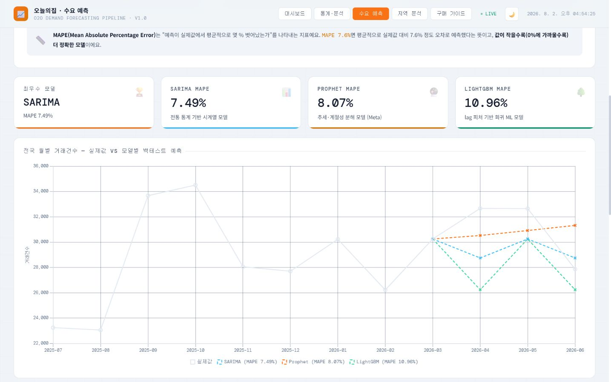

# 인테리어 수요 예측 대시보드 — 기술 포트폴리오

> 공공데이터 기반 풀스택 데이터 제품: **수집 → 정제 → 분석 → 서빙 → AI 인터페이스**까지
> 전 구간을 단독으로 설계·구현한 end-to-end 프로젝트입니다.

기간: 2026.03 ~ 진행 중 · 데이터 기준 2025.07~2026.06

**핵심 결과:** 102개 시군구 분석 · SARIMA MAPE 7.49% · Naive 대비 상대 3.39% 개선 ·
가중치 민감도 TOP10 최소 유지율 90% · 자동 테스트 57개

---

## 1. 한 줄 요약

> 국토교통부·한국부동산원·건축HUB·소상공인시장진흥공단 등 **5개 이상의 공공데이터 API**를
> 자동 수집·정규화해 **102개 시군구**의 "인테리어 수요 점수"를 산출하고, Flask 백엔드 +
> 네이버 지도 + 로컬 LLM 챗봇으로 서빙하는 데이터 제품을 기획부터 배포까지 혼자 구현했습니다.

---

## 2. 무엇을 만들었나

오늘의집 같은 O2O 인테리어 서비스가 "어느 지역에 영업·마케팅 리소스를 투입해야 하는가"를
데이터로 답하기 위한 의사결정 도구입니다.

- 아파트 매매·전월세 실거래가, 노후도, 입주예정 물량, 대수선(리모델링) 이력, 인테리어 관련
  업체/상가 밀도 등 **7개 지표**를 가중합산해 0~100점의 수요 점수를 산출
- 점수를 S/A/B 등급(+세부 단계)으로 분류해 랭킹 테이블·지도·차트로 시각화
- 시군구별 **예상 시공비 범위·시장 규모(억 원 단위)**까지 추정해 영업 우선순위 판단 보조
- 로컬 LLM(Ollama)을 붙여 "서초구 수요 점수 알려줘" 같은 자연어 질의에 실시간 데이터 기반으로 응답
- 정확한 지역을 선택하면 월별 거래 흐름·전국/시도 비교·유사 지역·상위 단지와 Qwen 해설을 제공하는
  `/region` 상세 분석 화면 구현
- 첫 집 구매자를 위한 별도 "구매 가이드" 탭 + 전용 챗봇까지 확장

---

## 3. 기술 스택

| 영역 | 사용 기술 |
|---|---|
| 데이터 수집 | Python `requests`, REST API 페이지네이션, `PublicDataReader` |
| 데이터 처리 | `pandas`, `numpy` — Min-Max 정규화, groupby 집계, LEFT JOIN 다중 병합 |
| 백엔드 | Flask, REST API 설계, SQLite |
| 프론트엔드 | Vanilla JS, Chart.js, Naver Maps JS SDK — 빌드 도구 없이 순수 구현 |
| AI/LLM | Ollama(qwen2.5:3b), 질문 대상만 검색하는 경량 RAG, 결정론적 순위·백분위 계산, 출력 감사, `difflib` 퍼지 매칭, SQLite 기록 |
| ML/통계 | SARIMA, Prophet, LightGBM, Naive 기준선, 시간 순서 홀드아웃, MAPE, 가중치 민감도 분석 |
| 인프라 | venv, `.env` 기반 키 관리, Git/GitHub |

---

## 4. 핵심 기술 포인트

### 4.1 다종 공공 API 통합 수집기 (`src/collector.py`, 763줄)

5개 이상의 서로 다른 공공데이터 API(국토부 매매/전월세 실거래가, 건축HUB 대수선 이력,
전국인테리어업체표준데이터, 소상공인 상가정보)를 **하나의 일관된 인터페이스**로 통합했습니다.

- API마다 다른 응답 스키마·페이지네이션 방식·인증 파라미터를 각각 분석해 흡수
- `fetch_recent_months()`처럼 "최근 N개월"을 자동 계산해 월별 반복 호출하는 제너릭 수집 함수 설계
- 영문 API 컬럼 → 한글 파이프라인 컬럼으로 표준화하는 `normalize_*` 계층을 분리해, 파이프라인이
  데이터 출처를 몰라도 동작하도록 결합도를 낮춤

### 4.2 행정구역 코드 불일치 문제 해결

가장 까다로웠던 부분은 **API마다 시군구를 식별하는 방식이 전부 달랐다는 점**입니다.

- 국토교통부 API: LAWD_CD(법정동 5자리, 구 단위 — 예: 용인시 처인구=41461)
- 전국인테리어업체표준데이터: 숫자 코드(예: 11650.0, float로 내려옴) **또는** 시군구명 텍스트만 단독으로 내려오는 경우가 혼재
- 소상공인 상가정보 API: 행정안전부 기준 시군구 코드(`divId=signguCd`), "서구"·"남구"·"중구" 등
  **동명 시군구가 8개 시도에 중복 존재**

이를 해결하기 위해:
1. `SIGUNGU_CODE_TO_FULL_NAME` 정적 매핑 테이블을 코드 기반으로 구축하고, 역방향 매핑
   (`FULL_NAME_TO_SIGUNGU_CODE`)을 함께 생성해 양방향 조회 가능하게 설계
2. 코드값이 숫자인지 텍스트인지를 런타임에 판별해 분기하는 `resolve_sigungu_code()` 폴백 로직 작성
   — 숫자 코드가 있으면 지명으로 변환, 없으면(경기도 일부 지자체가 구 단위 대신 시 단위로만
   응답하는 경우) 원본 텍스트를 그대로 사용하는 2단계 안전망
3. 소상공인 API는 **(시도, 시군구) 조합 키**로 매핑 테이블을 재설계해, "인천 서구"와 "광주 서구"가
   합산되어 버리는 데이터 오염 버그를 발견·수정 (1차 수집 시 208행 중복 → 2차 수정 후 정확히 102행)

> 실거래가 기반 인프라가 안정화된 뒤에도 새 데이터 소스를 붙일 때마다 이 매핑 문제가 반복적으로
> 발생했고, 그때마다 원인을 좁혀가며 디버깅한 과정 자체가 이 프로젝트의 핵심 역량입니다.

### 4.3 수요 점수 산출 파이프라인 (`src/pipeline.py`, 460줄)

- `load → preprocess(×5) → aggregate_and_merge → calculate_demand_score` 로 단계를 명확히 분리한
  파이프라인 클래스 설계 — 각 데이터 소스가 없어도(`None`) 0건으로 안전하게 처리되어 부분 데이터로도
  파이프라인이 깨지지 않음
- 건축년도 기준 4단계 세그먼트 분류(`New/Mid/Old/Very_Old_Apartment`) 후, 비즈니스 가설(1기 신도시
  재정비 연식대와 겹치는 15~20년차를 "핵심 타겟"으로 설정)을 코드 룰로 반영
- 7개 지표를 Min-Max 정규화 → 가중합산(`SCORE_WEIGHTS` 딕셔너리로 가중치 외부화, 전략 변경 시
  코드 수정 없이 파라미터만 교체 가능)
- 평형 환산(㎡→평) 후 등급별 시공 단가 구간을 적용해 **예상 시공비·시장 규모까지 자동 추정**하는
  비즈니스 로직 확장

### 4.4 LLM 인터페이스 — 로컬 sLM 기반 3개 흐름, 경량 RAG + 출력 감사

`qwen2.5:3b`라는 작은 로컬 모델(GPU 자체 구동, 외부 API 비용 0원)로도 정확한 데이터 기반 답변을
끌어내기 위해, 모델 자체를 키우는 대신 **프롬프트/컨텍스트 설계**로 정확도를 끌어올린 것이 이
챗봇 구현의 핵심입니다. 작은 모델일수록 컨텍스트 구성 방식이 답변 품질을 좌우한다는 점을
실험적으로 검증하며 만들었습니다.

**① 역할별 엔드포인트 분리**
- `/api/chat`(수요 점수 데이터 분석 챗봇)과 `/api/guide-chat`(첫 집 구매 절차 안내 챗봇)을
  엔드포인트·시스템 프롬프트·대화 기록을 완전히 분리해 운영
- `/api/region-insight`는 선택한 한 지역의 확정 지표만 받아 사업 관점 해설을 지연 생성한다. 페이지
  로딩과 LLM 호출을 분리해 모델이 느리거나 꺼져 있어도 핵심 지역 분석은 그대로 사용할 수 있다.
- 가이드 챗봇은 의도적으로 **데이터 컨텍스트를 주입하지 않음** — 도메인이 다른데 무관한 수치
  데이터를 같이 넣으면 모델이 엉뚱하게 섞어 쓰는 문제가 있어, 필요한 챗봇에만 컨텍스트를 붙이는
  것으로 설계 원칙을 세움

**② 전체 CSV 주입에서 질문 중심 검색으로 전환**
- 초기엔 시스템 프롬프트 하나에 설명+전체 CSV를 다 넣었는데, 3B급 소형 모델이 프롬프트 앞부분
  내용(설명)을 제대로 활용하지 못하고 순위·지역 데이터를 잘못 읽는 문제가 발생
- 현재는 전체 표를 제거하고 질문에서 찾은 지역·시도·단지 행만 전달한다. 지역 점수, 전국/시도 순위,
  등급과 7개 지표 백분위는 pandas 코드가 먼저 계산하고 모델은 문장화만 담당한다.
- `num_ctx`는 요청별 3,072~4,096으로 줄이고 `temperature=0.15`, `top_p=0.85`, 고정 시드,
  반복 억제와 60초 타임아웃을 공통 호출 함수에 적용했다. 입력 토큰과 응답 변동성을 동시에 줄였다.

**③ 경량 RAG — 질의 대상만 선별해 별도로 강조 전달**
- `find_region_context()`: 질문에서 형태소가 아닌 정규식 토큰을 추출해 시군구/시도명과 매칭,
  매칭된 행만 별도 블록으로 떼어내 "이 표의 값을 반드시 사용하라"고 명시 — 전체 표 안에서
  모델이 직접 찾게 두면 실패율이 높다는 걸 확인하고 만든 보강 로직. 검색 결과도 넓은 CSV 행이 아니라
  `점수·순위 / 핵심 7지표 / 백분위` 세 블록으로 직렬화해 숫자의 역할이 섞이지 않도록 했다.
- `build_ranking_summary()`: "1위가 어디냐"류 질문에서 작은 모델이 표를 스캔해 최댓값을 직접
  찾는 데 자주 실패하는 것을 발견하고, 순위를 **서버 코드에서 미리 계산**해 "1위: OO구 (64.1점)"
  형태로 텍스트화 — LLM에게 집계를 맡기지 않고 결정론적 연산은 코드가, 자연어 설명은 모델이
  담당하도록 역할을 분리
- 같은 패턴을 예상시공비·시장규모·상가업체수 등 신규 정보성 컬럼에도 적용 — 컬럼이 추가될 때마다
  "이 컬럼이 무슨 의미고 어떤 질문에 우선 쓰는지"를 시스템 프롬프트에 명시해, 원본 데이터가
  컨텍스트에 있어도 모델이 그 의미를 모르면 활용하지 못한다는 점을 재확인하고 보강

**④ 집계 단위 혼동 방지**
- "시군구"(개별 지표) vs "시도"(합계/평균)를 혼동해 "서울의 총거래건수를 서초구 값으로" 답하는
  실수를 막기 위해, 두 표의 의미 차이를 프롬프트에 명시적 규칙으로 박아둠 — LLM이 통계를 다룰 때
  흔히 발생하는 집계 단위 혼동을 프롬프트 레벨에서 방어

**⑤ 퍼지 매칭 — 사용자 입력 오차 흡수**
- 아파트 단지명을 오타·축약으로 입력해도(`레미안서초` ↔ `래미안서초...`) 인식하도록 부분 문자열
  매칭 1차 → `difflib.get_close_matches`(유사도 cutoff 0.6) 2차의 **2단계 매칭 전략** 구현
- 조사·접속사 등 의미 없는 토큰을 거르는 `CHAT_STOPWORDS`로 매칭 노이즈 사전 제거

**⑥ 응답 검증과 기록 영속화**
- SQLite `chat_logs` 테이블에 `chat_type` 컬럼을 둬 수요·가이드·지역 해설 기록을 한 테이블에서 분리 관리,
  기존 테이블에 컬럼이 없을 때를 대비한 `ALTER TABLE ... ADD COLUMN` 방어적 마이그레이션 포함
- `<think>` 태그와 비정상 빈 응답을 제거하고, 데이터에 없는 “고급 주거지·주민 성향·상권”을 원인으로
  붙인 문장은 출력 감사 단계에서 제외한다. 프롬프트만 믿지 않고 코드로 근거 경계를 닫았다.
- 연결 실패와 타임아웃을 분리해 기록하며 지역 화면은 LLM 실패 시 규칙 기반 분석을 계속 제공한다.

> **검증 예시:** `"강남구 수요 점수와 높은 이유를 핵심 수치로 알려줘"`에 실제 모델을 호출해
> `43.8점 · 전국 4위 · 서울 3위 · 평균 거래금액 275,271.6만원 · 전월세 2,216건`을 원본과 대조했다.
> 프롬프트 위반으로 생성된 미제공 지역 특성 문장은 출력 감사 테스트로 재발을 막았다.

### 4.5 지역 상세 분석

- 자유 입력 문자열로 직접 조회하지 않고 `/api/regions` 자동완성에서 정규화된 `시도|시군구` 키를
  선택해야 분석하도록 설계해 동명 지역과 오타 문제를 줄였다.
- 경기도 시 단위 결과는 용인시 처인·기흥·수지처럼 복수 법정동 API 코드를 합산한다.
- 전국/시도 순위, 7개 지표 백분위, 월별 매매·전월세·가격 흐름, 연식 구성, 거래 상위 단지,
  최근 실거래, 표준화 거리 기반 유사 지역을 한 화면에서 제공한다.
- 공유 가능한 `/region?key=서울|강남구` URL, 모바일 반응형, LLM 지연 생성과 실패 폴백을 검증했다.

### 4.6 시계열 백테스트와 가중치 민감도

| 모델 | 검증 MAPE | Naive 대비 |
|---|---:|---:|
| Naive Last Value | 7.75% | 기준선 |
| **SARIMA** | **7.49%** | **-0.26%p / 상대 3.39%** |
| Prophet | 8.07% | +0.32%p |
| LightGBM | 10.96% | +3.21%p |

- 2025.07~2026.06 12개월 중 마지막 3개월을 검증 구간으로 분리했다. LightGBM은 검증 실제값을
  lag로 재사용하지 않고 자신의 이전 예측값을 넣는 재귀 예측으로 평가 조건을 통일했다.
- SARIMA가 가장 낮은 MAPE를 기록했지만 나이브 기준선 대비 개선은 작다. 짧은 학습 기간과 단일
  홀드아웃이라는 한계를 결과와 함께 공개했다.
- 7개 점수 가중치를 각각 ±20% 변경한 14개 민감도 시나리오에서 최소 Spearman `0.9948`, TOP10
  최소 유지율 `90%`를 확인했다. 다만 개별 지역은 최대 12계단 움직여 절대 순위가 아님을 명시했다.

### 4.7 백엔드 / 프론트엔드

- Flask 위에 REST 엔드포인트(`/api/demand`, `/api/map-data`, `/api/regions`, `/api/region`,
  `/api/region-insight`, `/api/collect`, `/api/chat`, `/api/guide-chat` 등) 설계
- `/api/collect`는 외부 API 수집 → 정규화 → 파이프라인 재실행 → CSV 저장까지 **하나의 POST 요청으로
  전체 데이터 갱신 파이프라인을 트리거**하는 운영 편의 기능
- 빌드 도구 없이 Vanilla JS로 1,400줄 규모의 단일 페이지 대시보드 구현 (Chart.js 차트, Naver Maps
  마커 + 인포윈도우, 동적 테이블 렌더링)
- 지도에 **"수요 등급" / "시장규모·시공비" 2가지 보기 모드**를 토글 버튼으로 구현 — 동일한 마커
  렌더링 함수 안에서 모드별로 색상·크기 계산 로직만 분기시켜 코드 중복 없이 확장. 시장규모 모드는
  3-stop(남색→마젠타→핑크) 색상 보간 함수를 직접 작성해 값의 크기를 연속적인 그라데이션으로 표현
  (Chart.js 같은 라이브러리 없이 순수 JS로 RGB 보간 구현)
- Naver Maps Open API 인증 실패를 실제로 겪고 원인을 분리해본 경험: 스크립트 로드(200 OK)와 타일
  레벨 인증(Referer 기반)이 별개로 동작한다는 걸 확인했고, 로컬 IP로 접속할 때 Referer가 NCP 콘솔에
  등록된 Web 서비스 URL과 불일치하면 인증이 실패한다는 것을 검증함
- `screenshot.py`(Playwright)로 기능별 스크린샷 캡처를 자동화 — 페이지 레이아웃이 바뀔 때마다
  생기는 흔한 함정(요소가 뷰포트보다 커서 `scroll_into_view_if_needed()`만으로는 상단이 화면 밖으로
  나가 `clip` 좌표가 음수가 되는 문제)을 직접 겪고 `scrollIntoView({block:'start'})` 기반 헬퍼로
  교체해 해결

---

## 5. 문제 해결 과정 (디버깅 사례)

포트폴리오에서 "버그 없이 한 번에 됐다"보다 더 신뢰가 가는 건 **막혔을 때 어떻게 좁혀갔는가**라고
생각해 실제 트러블슈팅 사례를 정리합니다.

| 문제 | 원인 진단 | 해결 |
|---|---|---|
| 인테리어업체 API가 전부 0건 매칭 | 응답 시군구 코드가 float(`11650.0`)인데 파이프라인은 지명(`서초구`) 키 사용 | 숫자/텍스트 런타임 판별 후 코드→지명 변환 테이블 추가 |
| 경기도 306건이 매칭 누락 | 일부 API가 구 단위 대신 "수원시"처럼 시 단위로만 응답 | 매칭 실패 시 시군구명 원문을 그대로 쓰는 폴백 추가 |
| 소상공인 데이터가 208행으로 중복 | "서구"가 인천·광주·부산 등 8개 시도에 동명 존재, 시군구명 단일 키로 합산됨 | (시도, 시군구) 복합 키로 매핑 재설계 |
| 외부 API가 계속 404 | 활용신청 안 된 엔드포인트로 호출, 버전(`sdsc`/`sdsc2`) 혼동 | 여러 후보 엔드포인트를 체계적으로 시도해 정상 응답(`resultCode: 00`) 확인 후 필수 파라미터(`divId`) 역추적 |
| 수집 스크립트가 백그라운드에서 조용히 멈춤 | Python stdout 버퍼링으로 리다이렉트 로그가 비어 보임 | `PYTHONUNBUFFERED=1` 환경변수로 즉시 flush 강제 |

---

## 6. 정량 지표

- 분석 대상: **102개 시군구**(서울 25 · 경기 29 · 인천 9 · 부산 16 · 대구 8 · 광주 5 · 대전 5 · 울산 5)
- 처리 데이터: 매매 실거래 **350,170건**, 전월세 실거래 **720,777건**
- 핵심 Old 세그먼트: 매매 **45,647건**, 전월세 **80,055건**
- 연동 외부 API: **5개**(매매·전월세 실거래가, 대수선 이력, 인테리어업체 표준데이터, 소상공인 상가정보)
- 시계열 평가: SARIMA MAPE **7.49%**, Naive 기준선 대비 상대 **3.39% 개선**
- 민감도 평가: 14개 시나리오, 최소 순위 상관 **0.9948**, TOP10 최소 유지율 **90%**
- AI 인터페이스: 로컬 Qwen 2.5 3B 기반 수요 분석·구매 가이드·지역 해설 **3개 흐름**
- 자동 테스트: **57개 통과**

---

## 7. 이 프로젝트가 보여주는 역량

- **데이터 엔지니어링**: 이종 API 표준화, 결측/스키마 불일치 방어 로직, 멀티소스 병합 파이프라인
- **분석 설계력**: 막연한 "수요"를 측정 가능한 가중 지표로 분해하고, 비즈니스 가설(연식 타겟팅)을
  코드 룰로 구현
- **풀스택 구현력**: API 서버부터 지도 시각화, LLM 인터페이스까지 한 사람이 전 구간을 완결
- **문제 해결 태도**: 막혔을 때 추측 대신 응답 구조·파라미터를 직접 역추적해 원인을 좁히는 디버깅 습관
- **운영 관점**: `.env` 키 관리, `/api/collect`로 재현 가능한 데이터 갱신, 단계별 로그(`[LOAD]` `[PREPROCESS]`
  `[MERGE]` `[SCORE]`)로 파이프라인 가시성 확보

---

## 8. 더 보기

- 상세 사용법·아키텍처 다이어그램: [README.md](README.md)
- 모델 평가·누수 방지·민감도 분석: [docs/MODEL_EVALUATION.md](docs/MODEL_EVALUATION.md)
- 2~3분 시연 시나리오: [docs/DEMO_SCRIPT.md](docs/DEMO_SCRIPT.md)
- 배포 선택과 Docker 구성: [docs/DEPLOYMENT.md](docs/DEPLOYMENT.md)
- 인테리어 비용 데이터 산출 근거: [devlog/interior_cost_reference.md](devlog/interior_cost_reference.md)
- 개발 일지: [devlog/](devlog/)
